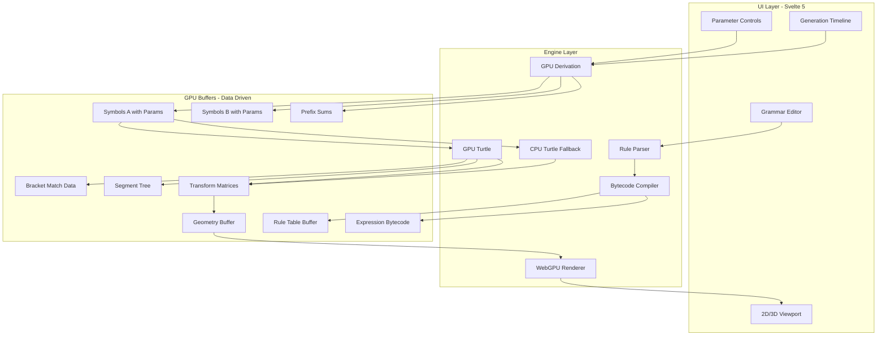

# WebGPU L-System Research and Visualization App

## Critical Design Decisions (Addressing Known Hard Problems)

### Problem 1: Parametric Expression Evaluation on GPU

Parametric rules like `A(l,w) : l > 5 -> F(l*0.9)B(l,w*0.7)` require arithmetic evaluation.

**Solution: Bytecode Expression System**

- Parser compiles expressions to fixed-format bytecode (not WGSL generation)
- Limited operation set: `ADD`, `SUB`, `MUL`, `DIV`, `GT`, `LT`, `EQ`, `AND`, `OR`
- GPU shader interprets bytecode via switch statement (no dynamic dispatch)
- Max 8 operations per expression, 4 parameters per symbol

```
// Expression bytecode format (32 bytes max per expression)
struct Expression {
  ops: array<u32, 8>,    // operation codes
  operands: array<f32, 8>, // constants or param indices (negative = param)
  result_param: i32,     // which param to write result to
}
```

### Problem 2: GPU Turtle Branch Stack (The Hardest Part)

The `[` and `]` brackets create tree structure that breaks linear prefix product.

**Solution: Research-Backed Parallel Hierarchy Extraction**

Based on the University of Copenhagen Futhark thesis (2020) that achieved **113M symbols/second** interpretation:

**5-Pass Bracket Matching Algorithm:**

1. **Depth Delta**: Map over string: `[` -> +1, `]` -> -1, else -> 0
2. **Absolute Depth**: Prefix sum gives depth at each position
3. **Bucket by Depth**: For each depth level, collect positions of brackets at that depth
4. **Bucket Offset Scan**: Scan within each depth bucket to get positions
5. **Match Array**: Consecutive elements in each bucket are matched pairs!

**Key Insight**: After bucketing by depth, consecutive bracket positions in each bucket are automatically matched pairs because brackets at the same depth interleave correctly.

**Example**: `F[+F[-G]H]I`

- Depths: `0,1,1,1,2,2,2,1,1,0`
- Depth 1 brackets at positions: 1, 8 (matched pair!)
- Depth 2 brackets at positions: 4, 6 (matched pair!)

**Two Architecture Options:**

*Option A: Work Queue (Complex but Faster)*

- After matching, create work items for each linear segment
- Process segments in parallel within workgroups
- Challenge: Dynamic work distribution is hard in WebGPU (no persistent threads)

*Option B: Level-by-Level Processing (Simpler, Recommended)*

- Process all depth-0 segments first (parallel prefix product on transforms)
- Then depth-1 segments, inheriting parent transforms
- Repeat for max_depth levels
- Requires max_depth serial passes but avoids dynamic scheduling
- Good fit for WebGPU's dispatch model

**WebGPU Prefix Sum Reference**: Use Stoneberry library pattern or webgpu-marching-cubes WGSL code as starting point.

**Fallback Strategy**: CPU turtle for debugging and systems < 10k symbols. GPU turtle activates above threshold.

### Problem 3: Buffer Size Limits

WebGPU storage buffers limited to ~128-256MB. Each symbol needs ~32 bytes with parameters.

**Solution: Tiered Buffer Strategy**

- Small (< 1M symbols): Single buffer pair
- Medium (1M - 4M): Double-buffered with size checks
- Large (> 4M): Generation caching to prevent re-derivation, warn user

```typescript
const SYMBOL_SIZE = 32; // bytes: id(4) + params(24) + metadata(4)
const MAX_BUFFER_SIZE = 128 * 1024 * 1024; // 128MB conservative
const MAX_SYMBOLS = Math.floor(MAX_BUFFER_SIZE / SYMBOL_SIZE); // ~4M symbols
```

### Problem 4: Timeline Scrubbing Memory

Storing all generation states causes memory explosion.

**Solution: Sparse Generation Cache**

- Cache every Nth generation (N = max(1, totalGens / 10))
- Re-derive from nearest cached generation when scrubbing
- Background worker pre-computes adjacent generations during idle

## Architecture Overview




## Symbol Buffer Layout (GPU-Friendly)

```
// Each symbol: 32 bytes, aligned for GPU access
struct Symbol {
  id: u32,                    // 4 bytes: symbol identifier
  flags: u32,                 // 4 bytes: is_drawable, is_branch, etc.
  params: array<f32, 4>,      // 16 bytes: up to 4 parameters (l, w, age, etc.)
  depth: u32,                 // 4 bytes: bracket nesting depth
  branch_id: u32,             // 4 bytes: which branch segment this belongs to
}
```

## Rule Table Structure (Data-Driven, Not Code-Gen)

```
// Rule lookup table in GPU buffer
struct Rule {
  predecessor_id: u32,        // symbol to match
  condition_expr_idx: i32,    // index into expression buffer (-1 = none)
  successor_count: u32,       // how many symbols this produces
  successor_offset: u32,      // offset into successor symbol array
  probability: f32,           // for stochastic rules (1.0 = deterministic)
}

// Successor templates
struct SuccessorTemplate {
  symbol_id: u32,
  param_expressions: array<i32, 4>, // indices into expression buffer
}
```

## Core Components

### 1. WebGPU Infrastructure (`src/lib/gpu/`)

- `device.ts` - Adapter/device init, capability detection, limits query
- `buffers.ts` - Buffer pool with size tracking, ping-pong management
- `pipelines.ts` - Compute/render pipeline creation and caching

### 2. Grammar Engine (`src/lib/grammar/`)

- `lexer.ts` - Tokenize rules, handle parametric syntax
- `parser.ts` - Build AST from tokens
- `bytecode.ts` - Compile expressions to bytecode format
- `validator.ts` - Check rule consistency, detect infinite loops

### 3. GPU Derivation (`src/lib/derivation/`)

- `prefix-sum.wgsl` - Blelloch scan with workgroup aggregation
- `derive.wgsl` - Symbol expansion using rule table lookup
- `derive.ts` - Orchestration, buffer swapping, size overflow handling

### 4. Turtle Interpreter (`src/lib/turtle/`)

- `cpu-turtle.ts` - Reference implementation, used for small systems
- `bracket-match.wgsl` - Parallel bracket pairing algorithm
- `segment-tree.wgsl` - Build tree structure from bracket data
- `transform.wgsl` - Hierarchical transform propagation
- `turtle.ts` - Orchestration, CPU/GPU selection based on size

### 5. Rendering (`src/lib/render/`)

- `renderer.ts` - WebGPU pipeline, instanced drawing
- `render-2d.wgsl` - 2D line rendering (Z=0, simplified)
- `render-3d.wgsl` - 3D tube/billboard rendering
- `visualization.wgsl` - HSL mapping, curve LUT sampling

### 6. State Management (`src/lib/stores/`)

Using Svelte 5 runes for reactive state:

```typescript
// params.svelte.ts
export const lsystemState = $state({
  axiom: 'F',
  rules: [] as Rule[],
  iterations: 5,
  angle: 25,
  stepSize: 10,
});

export const visualState = $state({
  hueMetric: 'depth',
  satMetric: 'age', 
  lightMetric: 'constant',
  curves: { hue: [...], sat: [...], light: [...] },
});

export const engineState = $state({
  symbolCount: 0,
  currentGeneration: 0,
  isComputing: false,
  gpuTurtleEnabled: true,
});
```

## File Structure

```
src/lib/
├── gpu/
│   ├── device.ts           # WebGPU initialization
│   ├── buffers.ts          # Buffer pool management
│   ├── pipelines.ts        # Pipeline creation
│   └── limits.ts           # Device capability constants
├── grammar/
│   ├── lexer.ts            # Tokenization
│   ├── parser.ts           # AST building
│   ├── bytecode.ts         # Expression compilation
│   ├── validator.ts        # Rule validation
│   └── types.ts            # Type definitions
├── derivation/
│   ├── derive.ts           # Orchestration
│   ├── prefix-sum.wgsl     # Parallel scan
│   └── derive.wgsl         # Symbol expansion
├── turtle/
│   ├── turtle.ts           # CPU/GPU orchestration
│   ├── cpu-turtle.ts       # Reference implementation
│   ├── bracket-match.wgsl  # Parallel bracket matching
│   ├── segment-tree.wgsl   # Tree construction
│   └── transform.wgsl      # Transform propagation
├── render/
│   ├── renderer.ts         # Pipeline management
│   ├── render-2d.wgsl      # 2D shaders
│   ├── render-3d.wgsl      # 3D shaders
│   └── visualization.wgsl  # Color mapping
├── stores/
│   ├── params.svelte.ts    # L-system parameters
│   ├── engine.svelte.ts    # Engine state
│   └── visual.svelte.ts    # Visualization settings
├── components/
│   ├── Canvas.svelte       # WebGPU canvas component
│   ├── Editor.svelte       # Grammar editor
│   ├── Controls.svelte     # Parameter sliders
│   ├── Timeline.svelte     # Generation scrubber
│   └── Viewport.svelte     # 2D/3D toggle wrapper
└── presets/
    └── examples.ts         # Classic L-systems (Koch, Dragon, etc.)

src/routes/
├── +page.svelte            # Main app
└── +layout.svelte          # App shell with Tailwind
```

## Implementation Phases (Ordered by Risk)

### Phase 1: Foundation (De-risk Core Loop)

- WebGPU device setup with fallback messaging
- CPU turtle implementation (reference/fallback)
- Basic D0L parser (no parameters)
- Simple 2D line rendering
- **Goal**: Render Koch snowflake, Dragon curve

### Phase 2: GPU Derivation

- Implement Blelloch prefix sum
- GPU symbol expansion with rule table
- Ping-pong buffer management
- **Goal**: 100k+ symbols at 60fps derivation

### Phase 3: Parametric System

- Expression bytecode compiler
- GPU expression evaluator
- Conditional rule matching
- **Goal**: Tree growth with tapering branches

### Phase 4: GPU Turtle (Hardest)

- Parallel bracket depth calculation
- Bracket matching algorithm
- Segment tree construction
- Hierarchical transform propagation
- **Goal**: Full GPU pipeline, no CPU in hot path

### Phase 5: Visualization

- HSL metric mapping
- Curve LUT system
- 3D tube rendering
- Camera controls (orbit, pan, zoom)
- **Goal**: Publication-quality renders

### Phase 6: UI Polish

- Monaco-based grammar editor
- Real-time validation/error highlighting
- Generation timeline with sparse caching
- Preset library (classic L-systems)
- **Goal**: Researcher-friendly interface

### Phase 7: Advanced Features

- Stochastic rule selection
- Context-sensitive matching (if time permits)
- Continuous growth interpolation
- Export (SVG, OBJ, PNG)

## Performance Targets

Based on Futhark thesis benchmarks (RTX 2080 Ti) with realistic WebGPU overhead:

- **Derivation**: 1-5 billion symbols/second (Futhark achieved 17.7B, WebGPU has ~70% overhead)
- **Interpretation**: 10-50M symbols/second (Futhark achieved 113M)
- **Rendering**: 60fps with 1M visible segments
- **Interaction**: < 100ms response to parameter changes
- **Memory**: Stay under 512MB GPU memory

## Research References

Key papers and implementations informing this architecture:

1. **Lipp et al. (2010)** - "Parallel Generation of L-Systems"
  - Lock-free parallel derivation via prefix sum
  - Supports parametric, stochastic, context-sensitive without atomics
2. **Bruun & Larsen (2020)** - Futhark L-System Thesis, University of Copenhagen
  - 17.7B symbols/sec derivation, 113M symbols/sec interpretation
  - 5-pass bracket matching algorithm (our reference implementation)
  - Confirms work queue is the hardest part
3. **Stoneberry Library** - WebGPU prefix scan implementation
  - Hierarchical multi-level approach for large datasets
  - Reference for our WGSL prefix sum
4. **Raphlinus (2021)** - "Prefix sum on portable compute shaders"
  - WebGPU cannot use decoupled look-back (Metal limitation)
  - Must use tree-reduction (Blelloch scan)
5. **webgpu-marching-cubes** - GitHub repository
  - Working WGSL exclusive scan code we can reference

## Known Limitations (Documented Upfront)

1. **Max ~4M symbols** due to WebGPU buffer limits
2. **No mesh shaders** - WebGPU doesn't support them yet
3. **No decoupled look-back** - Metal limitation forces tree-reduction scans
4. **Mobile support inconsistent** - iOS 17+, varies on Android
5. **Context-sensitive rules** add significant complexity (Phase 7 stretch goal)

